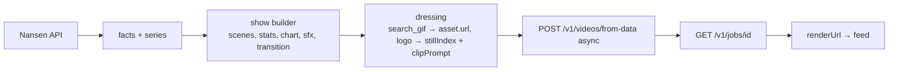

# nansen-shows

An open-source starter that turns Nansen smart-money data into seven authored shows. Clone it, swap the data adapter, and you have a data show pipeline.

Repository: [github.com/arambarnett/nansen-shows](https://github.com/arambarnett/nansen-shows)

```
src/monkeygun.ts   the API client: from-data with async jobs, job polling, media links
src/shows.ts       seven show builders: facts → scenes (hook, turn, receipts, stinger)
src/cli.ts         run a show for a token, a wallet or a chain
```

## The shows

| Show | Data | Pack, voice, look |
|---|---|---|
| Smart Money Alert | 24 h and 7 d net flow, smart traders | bold, green on near-black, karaoke captions |
| Dumb vs Smart | Fresh wallets vs smart money | cinematic, amber, bar captions |
| Who Got Rich | PnL leaderboard | bold, sky blue |
| Whale Alert | Largest trades | bold, red |
| First In | Earliest holders of a mover | bold, violet |
| Copy the Whale | A wallet's current positions | classic, green |
| Risk Check | Holder concentration, age, liquidity | editorial, amber |

Each builder returns the same thing: a `script` with typed scenes, a `brand`, a `voiceId`, a `music` mood and the `data` block that carries logos. The client sends it in one `from-data` call with `async: true`, polls the job, and stores `renderUrl`.

## Pipeline



## Swap the data source

The builders take plain objects in the [FlowSnapshot](../schemas/flow-snapshot.md) shape. Replace `src/nansen.ts` with an adapter for your data (an exchange's trade feed, DefiLlama, your own warehouse) that produces the same fields, and the seven shows work unchanged.

## Cost per episode

60 credits for script, voice and render, plus 100 for a 5-second Kling clip on the hook and 40 for a generated music bed: 200 credits, $2.00. Drop the clip and the bed and it is $0.60.
