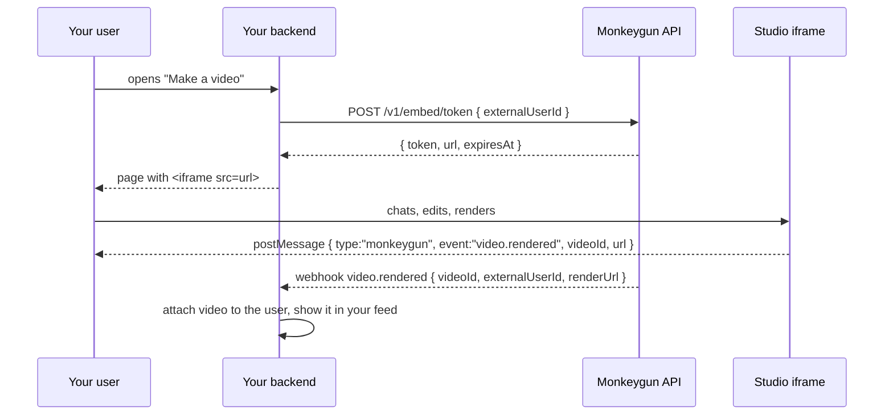

# Embedded studio

Put the full Monkeygun studio inside your app. Your users chat, edit and render; you get the videos, tagged with your user id, billed to your account.

## Flow



## 1. Mint a session on your backend

```bash
curl -X POST https://api.monkeygun.com/v1/embed/token -H "Authorization: Bearer $MK_KEY" \
  -d '{ "externalUserId": "0xabc…", "origin": "https://yourexchange.com", "channelId": "yourexchange", "showId": "customer-videos", "ttlSeconds": 3600 }'
# { "ok": true, "token": "emb_…", "expiresAt": "…", "url": "https://monkeygun.com/embed/studio#t=emb_…" }
```

| Field | Effect |
|---|---|
| `externalUserId` | Your user id (wallet, account id). Every video and chat in the session is tagged with it; users only see their own |
| `origin` | Your page origin, for postMessage targeting |
| `channelId`, `showId` | File the user's videos under a channel and show; the show's defaults, brand lock and CTA apply |
| `brand` | A brand lock forced on everything made in the session |
| `ttlSeconds` | 300 to 604800. Default 12 hours |

Never mint from the browser; the key must stay on your server.

## 2. Embed

```html
<iframe src="https://monkeygun.com/embed/studio#t=emb_…" allow="microphone; clipboard-write" style="width:100%;height:100%;border:0"></iframe>
<script>
window.addEventListener("message", (e) => {
  if (e.origin !== "https://monkeygun.com") return;
  const d = e.data;
  if (d?.type === "monkeygun" && d.event === "video.rendered") claim(d.videoId, d.url);
});
</script>
```

Events posted: `video.created` and `video.rendered`, each with `videoId` and a keyed `url`.

## 3. Attribute on the server

Do not rely on the browser. The rendered webhook for any video made in a session carries `externalUserId`, so your webhook handler can create the record even if the user closed the tab. tokenslop does both: the page calls a signed `claim` endpoint for instant feedback, and the webhook inserts any rendered video whose `externalUserId` is a wallet it has not seen.

## Billing and limits

Everything the user makes spends your account's credits. Price your users however you want (tokenslop sells credits at a markup and debits before the call). The studio shows the price of every step before it spends, and the [plan card](../concepts/credits-and-quotes.md) appears for anything over 200 credits.

## What the user can do inside

Everything the studio does: paste a link or a file, get a plan and a proof, make a video, edit by typing, swap voices and music, add a presenter, clone their voice, publish a share link. Set `showId` to constrain the look, or `brand` to lock it.
