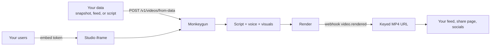

Monkeygun turns structured data into short vertical videos. Every number on screen comes from the payload you sent; the renderer draws the numerals itself, so a figure that is not in your data cannot appear in the video. Exchanges, yield protocols and data companies use it to put a video on every listing, pool, wallet and market move, and to let their own users make clips.

<CardGroup cols={2}>
  <Card title="Quickstart" icon="bolt" href="/quickstart">
    A token snapshot to a playable MP4 in one call, in under ten minutes.
  </Card>
  <Card title="Packages" icon="box" href="/packages">
    Video API, Feed + Creator Studio, Data Shows, and the show kit catalog.
  </Card>
  <Card title="Authored scripts" icon="clapperboard" href="/guides/authored-scripts">
    Write the scenes yourself: charts, stat cards, clips from a logo, Giphy loops, sound design, transitions.
  </Card>
  <Card title="Embedded studio" icon="window" href="/guides/embedded-studio">
    Put the full studio inside your app so your users create videos on your data.
  </Card>
</CardGroup>

## How it fits together



Three ways in, one engine underneath:

| Surface | What you send | What you get |
|---|---|---|
| **from-data** | A JSON snapshot, a brief, or a full script | A video, rendering in the background, with a webhook when the file is ready |
| **Tool catalog** | `POST /v1/tools/{name}` with the tool's arguments | Everything the studio can do: sources, quotes, edits, channels, shows, series, library, publishing |
| **Embedded studio** | An embed token for one of your users | The chat studio inside your page, billed to your account, tagged with your user id |

## Live examples

- [tokenslop.fun](https://tokenslop.fun) runs a feed of token videos on Robinhood Chain: house shows on a schedule, user-paid promos, and an embedded creator studio, all on this API. See [the tokenslop example](/examples/tokenslop).
- [nansen-shows](https://github.com/arambarnett/nansen-shows) is an open-source starter that turns Nansen smart-money data into seven authored shows. See [the Nansen example](/examples/nansen-shows).

## Base URL and auth

```
https://api.monkeygun.com/v1
Authorization: Bearer mk_live_…
```

Make a key in the studio under **Settings → Developer**. New accounts start with 500 credits. One credit is one cent. Every paid call returns `charged`.
